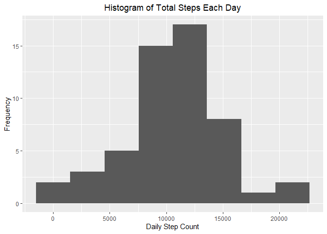
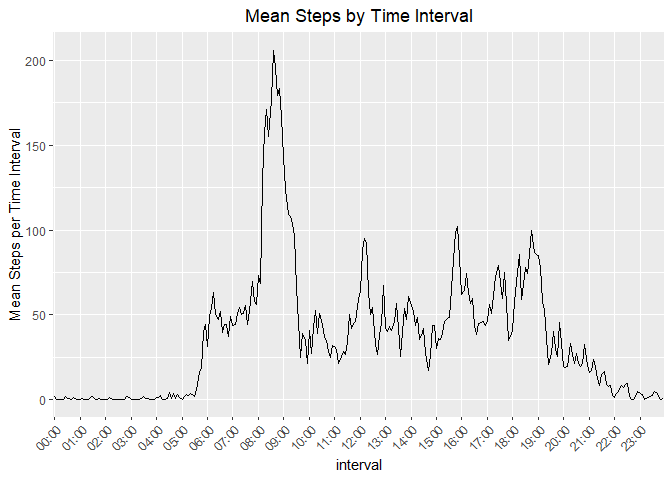
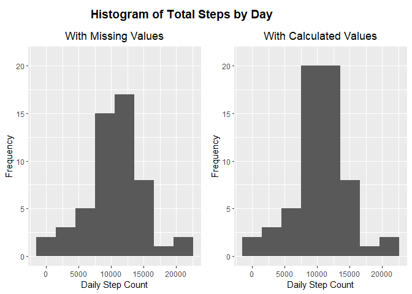
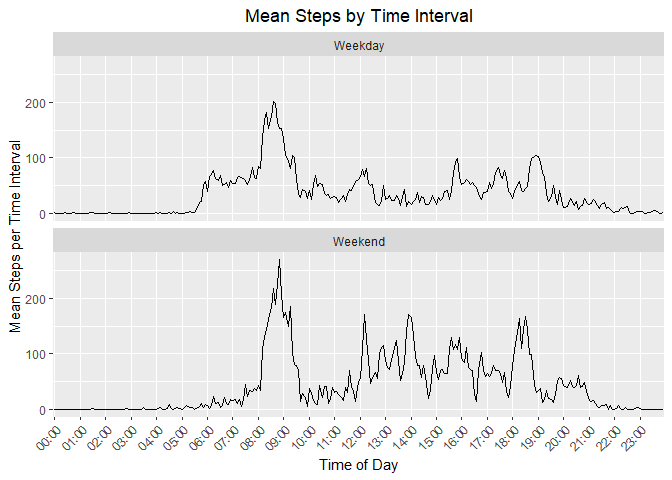

```r
# set defaults: cache chunks
knitr::opts_chunk$set(cache=TRUE)
```


## Loading and preprocessing the data

The data was obtained by forking the [project git repository](http://github.com/rdpeng/RepData_PeerAssessment1) and unzipping the file 'activity.zip' to ./data/raw and read into dataframe variable `df`.


```r
unzip('activity.zip', exdir = "./data/raw")
df <- read.csv('./data/raw/activity.csv')
```

Load the necessary libraries for this report:


```r
library(dplyr)
```

```
## 
## Attaching package: 'dplyr'
```

```
## The following objects are masked from 'package:stats':
## 
##     filter, lag
```

```
## The following objects are masked from 'package:base':
## 
##     intersect, setdiff, setequal, union
```

```r
library(numform)
library(lubridate)
```

```
## 
## Attaching package: 'lubridate'
```

```
## The following objects are masked from 'package:base':
## 
##     date, intersect, setdiff, union
```

```r
library(ggplot2)
# set ggplot title default to centre justified
theme_update(plot.title = element_text(hjust = 0.5))

library(kableExtra)
```

```
## 
## Attaching package: 'kableExtra'
```

```
## The following object is masked from 'package:dplyr':
## 
##     group_rows
```

```r
library(moments)
library(cowplot)
```

```
## 
## Attaching package: 'cowplot'
```

```
## The following object is masked from 'package:lubridate':
## 
##     stamp
```

The interval column is converted into *HH:mm* format while the date column is converted into date type:


```r
df <- df %>% 
  mutate(interval = sapply(interval, function(xtime) {
    xtime <- f_pad_zero(xtime, 4)
    xtime <- paste0(substr(xtime, 1, 2), ':', substr(xtime, 3, 4))
  })) %>%
  mutate(date = as_date(date))

head(df)
```

```
##   steps       date interval
## 1    NA 2012-10-01    00:00
## 2    NA 2012-10-01    00:05
## 3    NA 2012-10-01    00:10
## 4    NA 2012-10-01    00:15
## 5    NA 2012-10-01    00:20
## 6    NA 2012-10-01    00:25
```

## What is mean total number of steps taken per day?

### Calculate and report the mean, median and total step taken each day


```r
steps_by_day <- df %>% 
  group_by(date) %>% 
  summarise(
    Mean=round(mean(steps, na.rm=T),2), 
    Median=round(median(steps, na.rm=T),2),
    Total=sum(steps)
    ) %>%
  mutate(Mean = ifelse(is.nan(Mean), NA, Mean))

steps_by_day %>% 
  kbl() %>% 
  kable_styling(
    bootstrap_options = "striped", 
    full_width = F
    )
```

<table class="table table-striped" style="width: auto !important; margin-left: auto; margin-right: auto;">
 <thead>
  <tr>
   <th style="text-align:left;"> date </th>
   <th style="text-align:right;"> Mean </th>
   <th style="text-align:right;"> Median </th>
   <th style="text-align:right;"> Total </th>
  </tr>
 </thead>
<tbody>
  <tr>
   <td style="text-align:left;"> 2012-10-01 </td>
   <td style="text-align:right;"> NA </td>
   <td style="text-align:right;"> NA </td>
   <td style="text-align:right;"> NA </td>
  </tr>
  <tr>
   <td style="text-align:left;"> 2012-10-02 </td>
   <td style="text-align:right;"> 0.44 </td>
   <td style="text-align:right;"> 0 </td>
   <td style="text-align:right;"> 126 </td>
  </tr>
  <tr>
   <td style="text-align:left;"> 2012-10-03 </td>
   <td style="text-align:right;"> 39.42 </td>
   <td style="text-align:right;"> 0 </td>
   <td style="text-align:right;"> 11352 </td>
  </tr>
  <tr>
   <td style="text-align:left;"> 2012-10-04 </td>
   <td style="text-align:right;"> 42.07 </td>
   <td style="text-align:right;"> 0 </td>
   <td style="text-align:right;"> 12116 </td>
  </tr>
  <tr>
   <td style="text-align:left;"> 2012-10-05 </td>
   <td style="text-align:right;"> 46.16 </td>
   <td style="text-align:right;"> 0 </td>
   <td style="text-align:right;"> 13294 </td>
  </tr>
  <tr>
   <td style="text-align:left;"> 2012-10-06 </td>
   <td style="text-align:right;"> 53.54 </td>
   <td style="text-align:right;"> 0 </td>
   <td style="text-align:right;"> 15420 </td>
  </tr>
  <tr>
   <td style="text-align:left;"> 2012-10-07 </td>
   <td style="text-align:right;"> 38.25 </td>
   <td style="text-align:right;"> 0 </td>
   <td style="text-align:right;"> 11015 </td>
  </tr>
  <tr>
   <td style="text-align:left;"> 2012-10-08 </td>
   <td style="text-align:right;"> NA </td>
   <td style="text-align:right;"> NA </td>
   <td style="text-align:right;"> NA </td>
  </tr>
  <tr>
   <td style="text-align:left;"> 2012-10-09 </td>
   <td style="text-align:right;"> 44.48 </td>
   <td style="text-align:right;"> 0 </td>
   <td style="text-align:right;"> 12811 </td>
  </tr>
  <tr>
   <td style="text-align:left;"> 2012-10-10 </td>
   <td style="text-align:right;"> 34.38 </td>
   <td style="text-align:right;"> 0 </td>
   <td style="text-align:right;"> 9900 </td>
  </tr>
  <tr>
   <td style="text-align:left;"> 2012-10-11 </td>
   <td style="text-align:right;"> 35.78 </td>
   <td style="text-align:right;"> 0 </td>
   <td style="text-align:right;"> 10304 </td>
  </tr>
  <tr>
   <td style="text-align:left;"> 2012-10-12 </td>
   <td style="text-align:right;"> 60.35 </td>
   <td style="text-align:right;"> 0 </td>
   <td style="text-align:right;"> 17382 </td>
  </tr>
  <tr>
   <td style="text-align:left;"> 2012-10-13 </td>
   <td style="text-align:right;"> 43.15 </td>
   <td style="text-align:right;"> 0 </td>
   <td style="text-align:right;"> 12426 </td>
  </tr>
  <tr>
   <td style="text-align:left;"> 2012-10-14 </td>
   <td style="text-align:right;"> 52.42 </td>
   <td style="text-align:right;"> 0 </td>
   <td style="text-align:right;"> 15098 </td>
  </tr>
  <tr>
   <td style="text-align:left;"> 2012-10-15 </td>
   <td style="text-align:right;"> 35.20 </td>
   <td style="text-align:right;"> 0 </td>
   <td style="text-align:right;"> 10139 </td>
  </tr>
  <tr>
   <td style="text-align:left;"> 2012-10-16 </td>
   <td style="text-align:right;"> 52.38 </td>
   <td style="text-align:right;"> 0 </td>
   <td style="text-align:right;"> 15084 </td>
  </tr>
  <tr>
   <td style="text-align:left;"> 2012-10-17 </td>
   <td style="text-align:right;"> 46.71 </td>
   <td style="text-align:right;"> 0 </td>
   <td style="text-align:right;"> 13452 </td>
  </tr>
  <tr>
   <td style="text-align:left;"> 2012-10-18 </td>
   <td style="text-align:right;"> 34.92 </td>
   <td style="text-align:right;"> 0 </td>
   <td style="text-align:right;"> 10056 </td>
  </tr>
  <tr>
   <td style="text-align:left;"> 2012-10-19 </td>
   <td style="text-align:right;"> 41.07 </td>
   <td style="text-align:right;"> 0 </td>
   <td style="text-align:right;"> 11829 </td>
  </tr>
  <tr>
   <td style="text-align:left;"> 2012-10-20 </td>
   <td style="text-align:right;"> 36.09 </td>
   <td style="text-align:right;"> 0 </td>
   <td style="text-align:right;"> 10395 </td>
  </tr>
  <tr>
   <td style="text-align:left;"> 2012-10-21 </td>
   <td style="text-align:right;"> 30.63 </td>
   <td style="text-align:right;"> 0 </td>
   <td style="text-align:right;"> 8821 </td>
  </tr>
  <tr>
   <td style="text-align:left;"> 2012-10-22 </td>
   <td style="text-align:right;"> 46.74 </td>
   <td style="text-align:right;"> 0 </td>
   <td style="text-align:right;"> 13460 </td>
  </tr>
  <tr>
   <td style="text-align:left;"> 2012-10-23 </td>
   <td style="text-align:right;"> 30.97 </td>
   <td style="text-align:right;"> 0 </td>
   <td style="text-align:right;"> 8918 </td>
  </tr>
  <tr>
   <td style="text-align:left;"> 2012-10-24 </td>
   <td style="text-align:right;"> 29.01 </td>
   <td style="text-align:right;"> 0 </td>
   <td style="text-align:right;"> 8355 </td>
  </tr>
  <tr>
   <td style="text-align:left;"> 2012-10-25 </td>
   <td style="text-align:right;"> 8.65 </td>
   <td style="text-align:right;"> 0 </td>
   <td style="text-align:right;"> 2492 </td>
  </tr>
  <tr>
   <td style="text-align:left;"> 2012-10-26 </td>
   <td style="text-align:right;"> 23.53 </td>
   <td style="text-align:right;"> 0 </td>
   <td style="text-align:right;"> 6778 </td>
  </tr>
  <tr>
   <td style="text-align:left;"> 2012-10-27 </td>
   <td style="text-align:right;"> 35.14 </td>
   <td style="text-align:right;"> 0 </td>
   <td style="text-align:right;"> 10119 </td>
  </tr>
  <tr>
   <td style="text-align:left;"> 2012-10-28 </td>
   <td style="text-align:right;"> 39.78 </td>
   <td style="text-align:right;"> 0 </td>
   <td style="text-align:right;"> 11458 </td>
  </tr>
  <tr>
   <td style="text-align:left;"> 2012-10-29 </td>
   <td style="text-align:right;"> 17.42 </td>
   <td style="text-align:right;"> 0 </td>
   <td style="text-align:right;"> 5018 </td>
  </tr>
  <tr>
   <td style="text-align:left;"> 2012-10-30 </td>
   <td style="text-align:right;"> 34.09 </td>
   <td style="text-align:right;"> 0 </td>
   <td style="text-align:right;"> 9819 </td>
  </tr>
  <tr>
   <td style="text-align:left;"> 2012-10-31 </td>
   <td style="text-align:right;"> 53.52 </td>
   <td style="text-align:right;"> 0 </td>
   <td style="text-align:right;"> 15414 </td>
  </tr>
  <tr>
   <td style="text-align:left;"> 2012-11-01 </td>
   <td style="text-align:right;"> NA </td>
   <td style="text-align:right;"> NA </td>
   <td style="text-align:right;"> NA </td>
  </tr>
  <tr>
   <td style="text-align:left;"> 2012-11-02 </td>
   <td style="text-align:right;"> 36.81 </td>
   <td style="text-align:right;"> 0 </td>
   <td style="text-align:right;"> 10600 </td>
  </tr>
  <tr>
   <td style="text-align:left;"> 2012-11-03 </td>
   <td style="text-align:right;"> 36.70 </td>
   <td style="text-align:right;"> 0 </td>
   <td style="text-align:right;"> 10571 </td>
  </tr>
  <tr>
   <td style="text-align:left;"> 2012-11-04 </td>
   <td style="text-align:right;"> NA </td>
   <td style="text-align:right;"> NA </td>
   <td style="text-align:right;"> NA </td>
  </tr>
  <tr>
   <td style="text-align:left;"> 2012-11-05 </td>
   <td style="text-align:right;"> 36.25 </td>
   <td style="text-align:right;"> 0 </td>
   <td style="text-align:right;"> 10439 </td>
  </tr>
  <tr>
   <td style="text-align:left;"> 2012-11-06 </td>
   <td style="text-align:right;"> 28.94 </td>
   <td style="text-align:right;"> 0 </td>
   <td style="text-align:right;"> 8334 </td>
  </tr>
  <tr>
   <td style="text-align:left;"> 2012-11-07 </td>
   <td style="text-align:right;"> 44.73 </td>
   <td style="text-align:right;"> 0 </td>
   <td style="text-align:right;"> 12883 </td>
  </tr>
  <tr>
   <td style="text-align:left;"> 2012-11-08 </td>
   <td style="text-align:right;"> 11.18 </td>
   <td style="text-align:right;"> 0 </td>
   <td style="text-align:right;"> 3219 </td>
  </tr>
  <tr>
   <td style="text-align:left;"> 2012-11-09 </td>
   <td style="text-align:right;"> NA </td>
   <td style="text-align:right;"> NA </td>
   <td style="text-align:right;"> NA </td>
  </tr>
  <tr>
   <td style="text-align:left;"> 2012-11-10 </td>
   <td style="text-align:right;"> NA </td>
   <td style="text-align:right;"> NA </td>
   <td style="text-align:right;"> NA </td>
  </tr>
  <tr>
   <td style="text-align:left;"> 2012-11-11 </td>
   <td style="text-align:right;"> 43.78 </td>
   <td style="text-align:right;"> 0 </td>
   <td style="text-align:right;"> 12608 </td>
  </tr>
  <tr>
   <td style="text-align:left;"> 2012-11-12 </td>
   <td style="text-align:right;"> 37.38 </td>
   <td style="text-align:right;"> 0 </td>
   <td style="text-align:right;"> 10765 </td>
  </tr>
  <tr>
   <td style="text-align:left;"> 2012-11-13 </td>
   <td style="text-align:right;"> 25.47 </td>
   <td style="text-align:right;"> 0 </td>
   <td style="text-align:right;"> 7336 </td>
  </tr>
  <tr>
   <td style="text-align:left;"> 2012-11-14 </td>
   <td style="text-align:right;"> NA </td>
   <td style="text-align:right;"> NA </td>
   <td style="text-align:right;"> NA </td>
  </tr>
  <tr>
   <td style="text-align:left;"> 2012-11-15 </td>
   <td style="text-align:right;"> 0.14 </td>
   <td style="text-align:right;"> 0 </td>
   <td style="text-align:right;"> 41 </td>
  </tr>
  <tr>
   <td style="text-align:left;"> 2012-11-16 </td>
   <td style="text-align:right;"> 18.89 </td>
   <td style="text-align:right;"> 0 </td>
   <td style="text-align:right;"> 5441 </td>
  </tr>
  <tr>
   <td style="text-align:left;"> 2012-11-17 </td>
   <td style="text-align:right;"> 49.79 </td>
   <td style="text-align:right;"> 0 </td>
   <td style="text-align:right;"> 14339 </td>
  </tr>
  <tr>
   <td style="text-align:left;"> 2012-11-18 </td>
   <td style="text-align:right;"> 52.47 </td>
   <td style="text-align:right;"> 0 </td>
   <td style="text-align:right;"> 15110 </td>
  </tr>
  <tr>
   <td style="text-align:left;"> 2012-11-19 </td>
   <td style="text-align:right;"> 30.70 </td>
   <td style="text-align:right;"> 0 </td>
   <td style="text-align:right;"> 8841 </td>
  </tr>
  <tr>
   <td style="text-align:left;"> 2012-11-20 </td>
   <td style="text-align:right;"> 15.53 </td>
   <td style="text-align:right;"> 0 </td>
   <td style="text-align:right;"> 4472 </td>
  </tr>
  <tr>
   <td style="text-align:left;"> 2012-11-21 </td>
   <td style="text-align:right;"> 44.40 </td>
   <td style="text-align:right;"> 0 </td>
   <td style="text-align:right;"> 12787 </td>
  </tr>
  <tr>
   <td style="text-align:left;"> 2012-11-22 </td>
   <td style="text-align:right;"> 70.93 </td>
   <td style="text-align:right;"> 0 </td>
   <td style="text-align:right;"> 20427 </td>
  </tr>
  <tr>
   <td style="text-align:left;"> 2012-11-23 </td>
   <td style="text-align:right;"> 73.59 </td>
   <td style="text-align:right;"> 0 </td>
   <td style="text-align:right;"> 21194 </td>
  </tr>
  <tr>
   <td style="text-align:left;"> 2012-11-24 </td>
   <td style="text-align:right;"> 50.27 </td>
   <td style="text-align:right;"> 0 </td>
   <td style="text-align:right;"> 14478 </td>
  </tr>
  <tr>
   <td style="text-align:left;"> 2012-11-25 </td>
   <td style="text-align:right;"> 41.09 </td>
   <td style="text-align:right;"> 0 </td>
   <td style="text-align:right;"> 11834 </td>
  </tr>
  <tr>
   <td style="text-align:left;"> 2012-11-26 </td>
   <td style="text-align:right;"> 38.76 </td>
   <td style="text-align:right;"> 0 </td>
   <td style="text-align:right;"> 11162 </td>
  </tr>
  <tr>
   <td style="text-align:left;"> 2012-11-27 </td>
   <td style="text-align:right;"> 47.38 </td>
   <td style="text-align:right;"> 0 </td>
   <td style="text-align:right;"> 13646 </td>
  </tr>
  <tr>
   <td style="text-align:left;"> 2012-11-28 </td>
   <td style="text-align:right;"> 35.36 </td>
   <td style="text-align:right;"> 0 </td>
   <td style="text-align:right;"> 10183 </td>
  </tr>
  <tr>
   <td style="text-align:left;"> 2012-11-29 </td>
   <td style="text-align:right;"> 24.47 </td>
   <td style="text-align:right;"> 0 </td>
   <td style="text-align:right;"> 7047 </td>
  </tr>
  <tr>
   <td style="text-align:left;"> 2012-11-30 </td>
   <td style="text-align:right;"> NA </td>
   <td style="text-align:right;"> NA </td>
   <td style="text-align:right;"> NA </td>
  </tr>
</tbody>
</table>

### Make a histogram of the total number of steps taken each day:


```r
hist_withNA <- ggplot(steps_by_day, aes(Total)) + 
  geom_histogram(bins=8, na.rm=T) +
  ggtitle("Histogram of Total Steps Each Day") +
  xlab("Daily Step Count") +
  ylab("Frequency")
hist_withNA
```

<!-- -->

## What is the average daily activity pattern?

### Make a time series plot of the 5-minute interval (x-axis) and the average number of steps taken, averaged across all days (y-axis)


```r
steps_by_interval <- df %>% 
  group_by(interval) %>% 
  summarise(
    Mean=round(mean(steps, na.rm=T),2)
  )

every_nth = function(n) {
  return(function(x) {x[c(TRUE, rep(FALSE, n - 1))]})
}

ggplot(steps_by_interval, aes(y=Mean, x=interval, group=1)) + 
  geom_line() +
  ggtitle("Mean Steps by Time Interval") +
  ylab("Mean Steps per Time Interval") +
  theme(axis.text.x = element_text(angle=45, hjust = 1)) +
  scale_x_discrete(breaks = every_nth(n = 12))
```

<!-- -->


### Which 5-minute interval, on average across all the days in the dataset, contains the maximum number of steps?

From the data, the peak mean step count occurs in the 08:35 time interval, part of a sustained peak between 08:00 and 09:20. 

There are smaller peaks at around 12:00, 16:00 and 18:45.

## Imputing missing values

### Calculate and report the total number of missing values in the dataset (i.e. the total number of rows with `NA`s)


```r
na_count <- sum(is.na(df$steps))
na_count
```

```
## [1] 2304
```

There are 2304 missing values.

### Devise a strategy for filling in all of the missing values in the dataset. The strategy does not need to be sophisticated. For example, you could use the mean/median for that day, or the mean for that 5-minute interval, etc.

The step count is most likely influenced by both time of day and day of the week (weekday or weekend). 

Solution is to calculate the mean step count of the time interval and week day type that each NA value falls on.

First create a dataframe with those values:


```r
df_day_type <- df
df_day_type$day_type <- factor(ifelse(wday(df_day_type$date)<6, "Weekday", "Weekend"))
mean_by_daytype <- df_day_type %>%
  group_by(day_type, tod=interval) %>%
  summarise(Mean = mean(steps, na.rm = T))
```

```
## `summarise()` has grouped output by 'day_type'. You can override using the `.groups` argument.
```

Then create a function that takes an observation (row) and determines if the step count is NA. If it is, the function above is used to calculate the fill-in value, otherwise the original step count is returned.


```r
get_step_estimate <- function(observation, dmbw) {
  if (is.na(observation['steps'])){
    estimate <- dmbw %>% 
      subset(day_type==observation['day_type'] & tod==observation['interval'])
    estimate$Mean
  } else {
    observation['steps']
  }
}
```

### Create a new dataset that is equal to the original dataset but with the missing data filled in.

Tying these two together using `apply`, we create a new dataframe `df_noNA` with the filled-in values:


```r
df_noNA <- df_day_type %>%
  mutate(
    steps = as.numeric(apply(
      df_day_type, 
      1, 
      get_step_estimate, 
      dmbw=mean_by_daytype
    ))
  ) %>%
  select(-day_type)
head(df_noNA)
```

```
##       steps       date interval
## 1 2.3333333 2012-10-01    00:00
## 2 0.4615385 2012-10-01    00:05
## 3 0.1794872 2012-10-01    00:10
## 4 0.2051282 2012-10-01    00:15
## 5 0.1025641 2012-10-01    00:20
## 6 2.8461538 2012-10-01    00:25
```

### Make a histogram of the total number of steps taken each day and Calculate and report the mean and median total number of steps taken per day. 

A repeat of the calculation of steps by day needs to be performed on the dataset with calculated values.


```r
steps_by_day_noNA <- df_noNA %>% 
  group_by(date) %>% 
  summarise(
    Mean=round(mean(steps, na.rm=T),2), 
    Median=round(median(steps, na.rm=T),2),
    Total=round(sum(steps))
  )
```

Show the original histogram alongside the histogram of the new calculated dataset for comparison:


```r
# Create the histogram with calculated values
hist_noNA <- ggplot(steps_by_day_noNA, aes(Total)) + 
  geom_histogram(bins=8, na.rm=T) +
  ggtitle("Histogram of Total Steps Each Day") +
  xlab("Daily Step Count") +
  ylab("Frequency")

# Find the maximum frequency of both histograms, use the larger as the y axis limit
# Do this to make a like-for-like sisde by side comparison
with_NA_max_f <- max(ggplot_build(hist_withNA)$data[[1]]$ymax)
no_NA_max_f <- max(ggplot_build(hist_noNA)$data[[1]]$ymax)
y_lim <- max(c(with_NA_max_f, no_NA_max_f))

# Create a plot grid, use as a nested grid under a common title
hists <- plot_grid(
  hist_withNA + ylim(0, y_lim+1) + ggtitle("With Missing Values"), 
  hist_noNA + ylim(0, y_lim+1) + ggtitle("With Calculated Values")
  )

# Create the common title
title <- ggdraw() + 
  draw_label(
    "Histogram of Total Steps by Day",
    fontface = 'bold',
    x = 0,
    hjust = -0.5
  ) +
  theme(
    plot.margin = margin(0, 0, 0, 0)
  )

# Show the histograms under common title
plot_grid(
  title, hists,
  ncol = 1,
  # rel_heights values control vertical title margins
  rel_heights = c(0.1, 1)
)
```



```r
steps_by_day_noNA %>% 
  kbl() %>% 
  kable_styling(
    bootstrap_options = "striped", 
    full_width = F
    )
```

<table class="table table-striped" style="width: auto !important; margin-left: auto; margin-right: auto;">
 <thead>
  <tr>
   <th style="text-align:left;"> date </th>
   <th style="text-align:right;"> Mean </th>
   <th style="text-align:right;"> Median </th>
   <th style="text-align:right;"> Total </th>
  </tr>
 </thead>
<tbody>
  <tr>
   <td style="text-align:left;"> 2012-10-01 </td>
   <td style="text-align:right;"> 35.29 </td>
   <td style="text-align:right;"> 26.35 </td>
   <td style="text-align:right;"> 10163 </td>
  </tr>
  <tr>
   <td style="text-align:left;"> 2012-10-02 </td>
   <td style="text-align:right;"> 0.44 </td>
   <td style="text-align:right;"> 0.00 </td>
   <td style="text-align:right;"> 126 </td>
  </tr>
  <tr>
   <td style="text-align:left;"> 2012-10-03 </td>
   <td style="text-align:right;"> 39.42 </td>
   <td style="text-align:right;"> 0.00 </td>
   <td style="text-align:right;"> 11352 </td>
  </tr>
  <tr>
   <td style="text-align:left;"> 2012-10-04 </td>
   <td style="text-align:right;"> 42.07 </td>
   <td style="text-align:right;"> 0.00 </td>
   <td style="text-align:right;"> 12116 </td>
  </tr>
  <tr>
   <td style="text-align:left;"> 2012-10-05 </td>
   <td style="text-align:right;"> 46.16 </td>
   <td style="text-align:right;"> 0.00 </td>
   <td style="text-align:right;"> 13294 </td>
  </tr>
  <tr>
   <td style="text-align:left;"> 2012-10-06 </td>
   <td style="text-align:right;"> 53.54 </td>
   <td style="text-align:right;"> 0.00 </td>
   <td style="text-align:right;"> 15420 </td>
  </tr>
  <tr>
   <td style="text-align:left;"> 2012-10-07 </td>
   <td style="text-align:right;"> 38.25 </td>
   <td style="text-align:right;"> 0.00 </td>
   <td style="text-align:right;"> 11015 </td>
  </tr>
  <tr>
   <td style="text-align:left;"> 2012-10-08 </td>
   <td style="text-align:right;"> 35.29 </td>
   <td style="text-align:right;"> 26.35 </td>
   <td style="text-align:right;"> 10163 </td>
  </tr>
  <tr>
   <td style="text-align:left;"> 2012-10-09 </td>
   <td style="text-align:right;"> 44.48 </td>
   <td style="text-align:right;"> 0.00 </td>
   <td style="text-align:right;"> 12811 </td>
  </tr>
  <tr>
   <td style="text-align:left;"> 2012-10-10 </td>
   <td style="text-align:right;"> 34.38 </td>
   <td style="text-align:right;"> 0.00 </td>
   <td style="text-align:right;"> 9900 </td>
  </tr>
  <tr>
   <td style="text-align:left;"> 2012-10-11 </td>
   <td style="text-align:right;"> 35.78 </td>
   <td style="text-align:right;"> 0.00 </td>
   <td style="text-align:right;"> 10304 </td>
  </tr>
  <tr>
   <td style="text-align:left;"> 2012-10-12 </td>
   <td style="text-align:right;"> 60.35 </td>
   <td style="text-align:right;"> 0.00 </td>
   <td style="text-align:right;"> 17382 </td>
  </tr>
  <tr>
   <td style="text-align:left;"> 2012-10-13 </td>
   <td style="text-align:right;"> 43.15 </td>
   <td style="text-align:right;"> 0.00 </td>
   <td style="text-align:right;"> 12426 </td>
  </tr>
  <tr>
   <td style="text-align:left;"> 2012-10-14 </td>
   <td style="text-align:right;"> 52.42 </td>
   <td style="text-align:right;"> 0.00 </td>
   <td style="text-align:right;"> 15098 </td>
  </tr>
  <tr>
   <td style="text-align:left;"> 2012-10-15 </td>
   <td style="text-align:right;"> 35.20 </td>
   <td style="text-align:right;"> 0.00 </td>
   <td style="text-align:right;"> 10139 </td>
  </tr>
  <tr>
   <td style="text-align:left;"> 2012-10-16 </td>
   <td style="text-align:right;"> 52.38 </td>
   <td style="text-align:right;"> 0.00 </td>
   <td style="text-align:right;"> 15084 </td>
  </tr>
  <tr>
   <td style="text-align:left;"> 2012-10-17 </td>
   <td style="text-align:right;"> 46.71 </td>
   <td style="text-align:right;"> 0.00 </td>
   <td style="text-align:right;"> 13452 </td>
  </tr>
  <tr>
   <td style="text-align:left;"> 2012-10-18 </td>
   <td style="text-align:right;"> 34.92 </td>
   <td style="text-align:right;"> 0.00 </td>
   <td style="text-align:right;"> 10056 </td>
  </tr>
  <tr>
   <td style="text-align:left;"> 2012-10-19 </td>
   <td style="text-align:right;"> 41.07 </td>
   <td style="text-align:right;"> 0.00 </td>
   <td style="text-align:right;"> 11829 </td>
  </tr>
  <tr>
   <td style="text-align:left;"> 2012-10-20 </td>
   <td style="text-align:right;"> 36.09 </td>
   <td style="text-align:right;"> 0.00 </td>
   <td style="text-align:right;"> 10395 </td>
  </tr>
  <tr>
   <td style="text-align:left;"> 2012-10-21 </td>
   <td style="text-align:right;"> 30.63 </td>
   <td style="text-align:right;"> 0.00 </td>
   <td style="text-align:right;"> 8821 </td>
  </tr>
  <tr>
   <td style="text-align:left;"> 2012-10-22 </td>
   <td style="text-align:right;"> 46.74 </td>
   <td style="text-align:right;"> 0.00 </td>
   <td style="text-align:right;"> 13460 </td>
  </tr>
  <tr>
   <td style="text-align:left;"> 2012-10-23 </td>
   <td style="text-align:right;"> 30.97 </td>
   <td style="text-align:right;"> 0.00 </td>
   <td style="text-align:right;"> 8918 </td>
  </tr>
  <tr>
   <td style="text-align:left;"> 2012-10-24 </td>
   <td style="text-align:right;"> 29.01 </td>
   <td style="text-align:right;"> 0.00 </td>
   <td style="text-align:right;"> 8355 </td>
  </tr>
  <tr>
   <td style="text-align:left;"> 2012-10-25 </td>
   <td style="text-align:right;"> 8.65 </td>
   <td style="text-align:right;"> 0.00 </td>
   <td style="text-align:right;"> 2492 </td>
  </tr>
  <tr>
   <td style="text-align:left;"> 2012-10-26 </td>
   <td style="text-align:right;"> 23.53 </td>
   <td style="text-align:right;"> 0.00 </td>
   <td style="text-align:right;"> 6778 </td>
  </tr>
  <tr>
   <td style="text-align:left;"> 2012-10-27 </td>
   <td style="text-align:right;"> 35.14 </td>
   <td style="text-align:right;"> 0.00 </td>
   <td style="text-align:right;"> 10119 </td>
  </tr>
  <tr>
   <td style="text-align:left;"> 2012-10-28 </td>
   <td style="text-align:right;"> 39.78 </td>
   <td style="text-align:right;"> 0.00 </td>
   <td style="text-align:right;"> 11458 </td>
  </tr>
  <tr>
   <td style="text-align:left;"> 2012-10-29 </td>
   <td style="text-align:right;"> 17.42 </td>
   <td style="text-align:right;"> 0.00 </td>
   <td style="text-align:right;"> 5018 </td>
  </tr>
  <tr>
   <td style="text-align:left;"> 2012-10-30 </td>
   <td style="text-align:right;"> 34.09 </td>
   <td style="text-align:right;"> 0.00 </td>
   <td style="text-align:right;"> 9819 </td>
  </tr>
  <tr>
   <td style="text-align:left;"> 2012-10-31 </td>
   <td style="text-align:right;"> 53.52 </td>
   <td style="text-align:right;"> 0.00 </td>
   <td style="text-align:right;"> 15414 </td>
  </tr>
  <tr>
   <td style="text-align:left;"> 2012-11-01 </td>
   <td style="text-align:right;"> 35.29 </td>
   <td style="text-align:right;"> 26.35 </td>
   <td style="text-align:right;"> 10163 </td>
  </tr>
  <tr>
   <td style="text-align:left;"> 2012-11-02 </td>
   <td style="text-align:right;"> 36.81 </td>
   <td style="text-align:right;"> 0.00 </td>
   <td style="text-align:right;"> 10600 </td>
  </tr>
  <tr>
   <td style="text-align:left;"> 2012-11-03 </td>
   <td style="text-align:right;"> 36.70 </td>
   <td style="text-align:right;"> 0.00 </td>
   <td style="text-align:right;"> 10571 </td>
  </tr>
  <tr>
   <td style="text-align:left;"> 2012-11-04 </td>
   <td style="text-align:right;"> 35.29 </td>
   <td style="text-align:right;"> 26.35 </td>
   <td style="text-align:right;"> 10163 </td>
  </tr>
  <tr>
   <td style="text-align:left;"> 2012-11-05 </td>
   <td style="text-align:right;"> 36.25 </td>
   <td style="text-align:right;"> 0.00 </td>
   <td style="text-align:right;"> 10439 </td>
  </tr>
  <tr>
   <td style="text-align:left;"> 2012-11-06 </td>
   <td style="text-align:right;"> 28.94 </td>
   <td style="text-align:right;"> 0.00 </td>
   <td style="text-align:right;"> 8334 </td>
  </tr>
  <tr>
   <td style="text-align:left;"> 2012-11-07 </td>
   <td style="text-align:right;"> 44.73 </td>
   <td style="text-align:right;"> 0.00 </td>
   <td style="text-align:right;"> 12883 </td>
  </tr>
  <tr>
   <td style="text-align:left;"> 2012-11-08 </td>
   <td style="text-align:right;"> 11.18 </td>
   <td style="text-align:right;"> 0.00 </td>
   <td style="text-align:right;"> 3219 </td>
  </tr>
  <tr>
   <td style="text-align:left;"> 2012-11-09 </td>
   <td style="text-align:right;"> 43.22 </td>
   <td style="text-align:right;"> 22.29 </td>
   <td style="text-align:right;"> 12448 </td>
  </tr>
  <tr>
   <td style="text-align:left;"> 2012-11-10 </td>
   <td style="text-align:right;"> 43.22 </td>
   <td style="text-align:right;"> 22.29 </td>
   <td style="text-align:right;"> 12448 </td>
  </tr>
  <tr>
   <td style="text-align:left;"> 2012-11-11 </td>
   <td style="text-align:right;"> 43.78 </td>
   <td style="text-align:right;"> 0.00 </td>
   <td style="text-align:right;"> 12608 </td>
  </tr>
  <tr>
   <td style="text-align:left;"> 2012-11-12 </td>
   <td style="text-align:right;"> 37.38 </td>
   <td style="text-align:right;"> 0.00 </td>
   <td style="text-align:right;"> 10765 </td>
  </tr>
  <tr>
   <td style="text-align:left;"> 2012-11-13 </td>
   <td style="text-align:right;"> 25.47 </td>
   <td style="text-align:right;"> 0.00 </td>
   <td style="text-align:right;"> 7336 </td>
  </tr>
  <tr>
   <td style="text-align:left;"> 2012-11-14 </td>
   <td style="text-align:right;"> 35.29 </td>
   <td style="text-align:right;"> 26.35 </td>
   <td style="text-align:right;"> 10163 </td>
  </tr>
  <tr>
   <td style="text-align:left;"> 2012-11-15 </td>
   <td style="text-align:right;"> 0.14 </td>
   <td style="text-align:right;"> 0.00 </td>
   <td style="text-align:right;"> 41 </td>
  </tr>
  <tr>
   <td style="text-align:left;"> 2012-11-16 </td>
   <td style="text-align:right;"> 18.89 </td>
   <td style="text-align:right;"> 0.00 </td>
   <td style="text-align:right;"> 5441 </td>
  </tr>
  <tr>
   <td style="text-align:left;"> 2012-11-17 </td>
   <td style="text-align:right;"> 49.79 </td>
   <td style="text-align:right;"> 0.00 </td>
   <td style="text-align:right;"> 14339 </td>
  </tr>
  <tr>
   <td style="text-align:left;"> 2012-11-18 </td>
   <td style="text-align:right;"> 52.47 </td>
   <td style="text-align:right;"> 0.00 </td>
   <td style="text-align:right;"> 15110 </td>
  </tr>
  <tr>
   <td style="text-align:left;"> 2012-11-19 </td>
   <td style="text-align:right;"> 30.70 </td>
   <td style="text-align:right;"> 0.00 </td>
   <td style="text-align:right;"> 8841 </td>
  </tr>
  <tr>
   <td style="text-align:left;"> 2012-11-20 </td>
   <td style="text-align:right;"> 15.53 </td>
   <td style="text-align:right;"> 0.00 </td>
   <td style="text-align:right;"> 4472 </td>
  </tr>
  <tr>
   <td style="text-align:left;"> 2012-11-21 </td>
   <td style="text-align:right;"> 44.40 </td>
   <td style="text-align:right;"> 0.00 </td>
   <td style="text-align:right;"> 12787 </td>
  </tr>
  <tr>
   <td style="text-align:left;"> 2012-11-22 </td>
   <td style="text-align:right;"> 70.93 </td>
   <td style="text-align:right;"> 0.00 </td>
   <td style="text-align:right;"> 20427 </td>
  </tr>
  <tr>
   <td style="text-align:left;"> 2012-11-23 </td>
   <td style="text-align:right;"> 73.59 </td>
   <td style="text-align:right;"> 0.00 </td>
   <td style="text-align:right;"> 21194 </td>
  </tr>
  <tr>
   <td style="text-align:left;"> 2012-11-24 </td>
   <td style="text-align:right;"> 50.27 </td>
   <td style="text-align:right;"> 0.00 </td>
   <td style="text-align:right;"> 14478 </td>
  </tr>
  <tr>
   <td style="text-align:left;"> 2012-11-25 </td>
   <td style="text-align:right;"> 41.09 </td>
   <td style="text-align:right;"> 0.00 </td>
   <td style="text-align:right;"> 11834 </td>
  </tr>
  <tr>
   <td style="text-align:left;"> 2012-11-26 </td>
   <td style="text-align:right;"> 38.76 </td>
   <td style="text-align:right;"> 0.00 </td>
   <td style="text-align:right;"> 11162 </td>
  </tr>
  <tr>
   <td style="text-align:left;"> 2012-11-27 </td>
   <td style="text-align:right;"> 47.38 </td>
   <td style="text-align:right;"> 0.00 </td>
   <td style="text-align:right;"> 13646 </td>
  </tr>
  <tr>
   <td style="text-align:left;"> 2012-11-28 </td>
   <td style="text-align:right;"> 35.36 </td>
   <td style="text-align:right;"> 0.00 </td>
   <td style="text-align:right;"> 10183 </td>
  </tr>
  <tr>
   <td style="text-align:left;"> 2012-11-29 </td>
   <td style="text-align:right;"> 24.47 </td>
   <td style="text-align:right;"> 0.00 </td>
   <td style="text-align:right;"> 7047 </td>
  </tr>
  <tr>
   <td style="text-align:left;"> 2012-11-30 </td>
   <td style="text-align:right;"> 43.22 </td>
   <td style="text-align:right;"> 22.29 </td>
   <td style="text-align:right;"> 12448 </td>
  </tr>
</tbody>
</table>

### Do these values differ from the estimates from the first part of the assignment? 

The most common daily counts (i.e. the modal values) appear to have been disproportionally stretched, while the tails appear unchanged. Since we are adding average values, this is expected.

The skewness of the data increases for the dataset with calculated values indicating the mean and median have been pulled to the right.This is in keeping with the above observation as the most common values are higher than the mean and median.


```r
skewness(df$steps, na.rm=T)
```

```
## [1] 4.171477
```

```r
skewness(df_noNA$steps)
```

```
## [1] 4.337421
```

### What is the impact of imputing missing data on the estimates of the total daily number of steps?

Total number of steps have expectedly risen given that most `NA` values were replaced with values greater than zero.


```r
total_with_na <- sum(df$steps, na.rm = T)
total_with_na
```

```
## [1] 570608
```

```r
total_no_na <- as.integer(sum(df_noNA$steps))
total_no_na
```

```
## [1] 658763
```

Total steps with NAs: 570608

Total steps with calculated values: 658763

Increase: 88155

Looking at the increase per day, it appears to have only affected the overall count for days where all values were NA. We can infer (presuming the calculations are correct) that any NA values with partial step counts occurred when the mean step count for that time/day of week were also 0.


```r
raw_step_count <- steps_by_day$Total
# NA values count zero towards the sum
raw_step_count[is.na(raw_step_count)] <- 0
daily_diff <- steps_by_day_noNA$Total - raw_step_count
daily_diff
```

```
##  [1] 10163     0     0     0     0     0     0 10163     0     0     0     0
## [13]     0     0     0     0     0     0     0     0     0     0     0     0
## [25]     0     0     0     0     0     0     0 10163     0     0 10163     0
## [37]     0     0     0 12448 12448     0     0     0 10163     0     0     0
## [49]     0     0     0     0     0     0     0     0     0     0     0     0
## [61] 12448
```

## Are there differences in activity patterns between weekdays and weekends?

### Create a new factor variable in the dataset with two levels – “weekday” and “weekend” indicating whether a given date is a weekday or weekend day.


```r
df$day_type <- factor(ifelse(wday(df$date)<6, "Weekday", "Weekend"))
head(df)
```

```
##   steps       date interval day_type
## 1    NA 2012-10-01    00:00  Weekday
## 2    NA 2012-10-01    00:05  Weekday
## 3    NA 2012-10-01    00:10  Weekday
## 4    NA 2012-10-01    00:15  Weekday
## 5    NA 2012-10-01    00:20  Weekday
## 6    NA 2012-10-01    00:25  Weekday
```

### Make a panel plot containing a time series plot of the 5-minute interval (x-axis) and the average number of steps taken, averaged across all weekday days or weekend days (y-axis). 


```r
steps_by_interval <- df %>% 
  group_by(day_type, interval) %>% 
  summarise(
    Mean=round(mean(steps, na.rm=T),2)
  )
```

```
## `summarise()` has grouped output by 'day_type'. You can override using the `.groups` argument.
```

```r
ggplot(steps_by_interval, aes(y=Mean, x=interval, group=1)) + 
  geom_line() +
  ggtitle("Mean Steps by Time Interval") +
  ylab("Mean Steps per Time Interval") +
  theme(axis.text.x = element_text(angle=45, hjust = 1)) +
  scale_x_discrete(breaks = every_nth(n = 12)) +
  xlab("Time of Day") +
  facet_wrap(~ day_type, ncol = 1)
```



The initial comparison shows that weekdays have more activity in the early part of the day (6am - 8am), however the weekends show a bigger peak between 8am and 10am and more sustained activity during the afternoons and early evening.

By looking at the mean total steps each day by weekend or weekday, we can see weekend days are on average approximately 20% more active than weekdays.


```r
df %>% 
  group_by(day_type) %>% 
  summarise(
    Mean=round(mean(steps, na.rm=T),2)
  )
```

```
## # A tibble: 2 x 2
##   day_type  Mean
##   <fct>    <dbl>
## 1 Weekday   35.3
## 2 Weekend   43.2
```


-----

